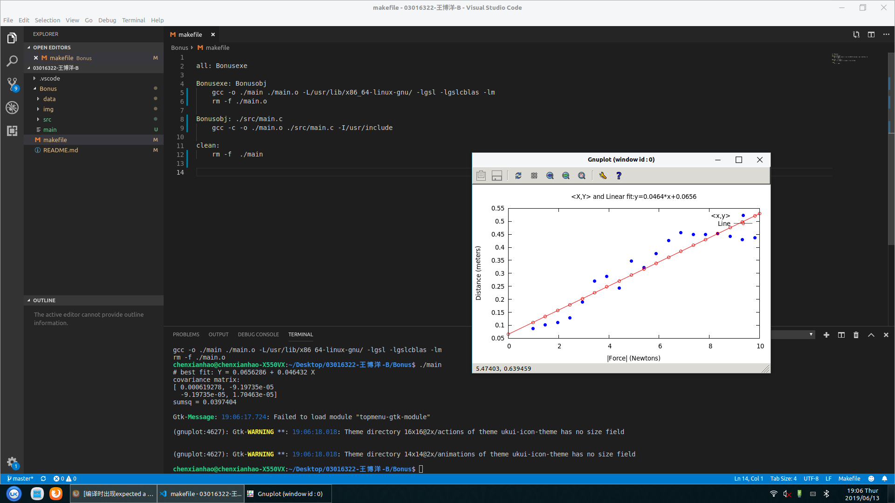
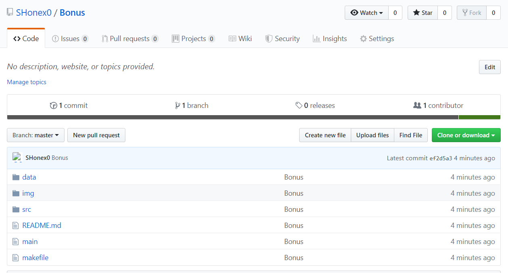

这次的作业主要分为两部分：

第一部分为在Ubuntu上使用Gcc编译器，并使用GSL进行线性回归进行绘图；第二部分是以Git进行版本控制，并且利用GitHub进行作业的管理和更新。

第一部分：

ubuntu是一个基于Debian的免费开源操作系统和Linux发行版。我们可以通过使用Unbuntu进行较为复杂的开发。
为了对数据进行拟合，首先读取文件中的数据，并将数据存放为适合的格式。此后使用GSL自带函数gsl_fit_linear进行拟合，输出的图像如下：

第二部分：
git作为一种软件开发中的较为实用的版本控制器，全球最大的开发者聚集地GitHub也是以Git为基础，因此学习Git的使用对于我们更好的掌握软件工程这门课程有着十分重要的作用。
首先配置开发者信息，再与本地存储器上建立个人仓库，
网址如下：

网址：
https://github.com/SHonex0/Bonus

截图：
